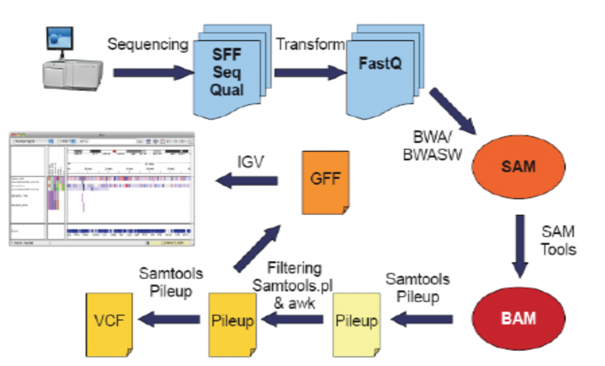
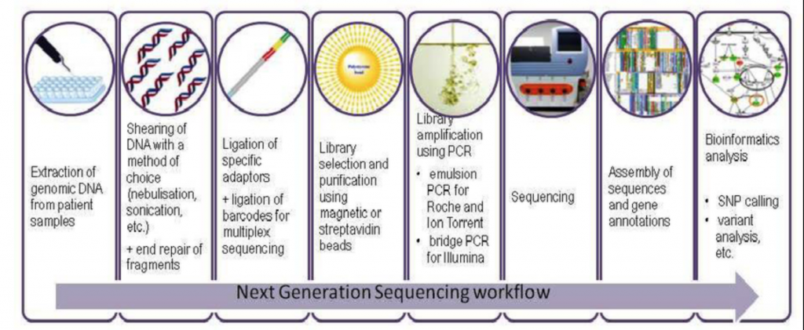
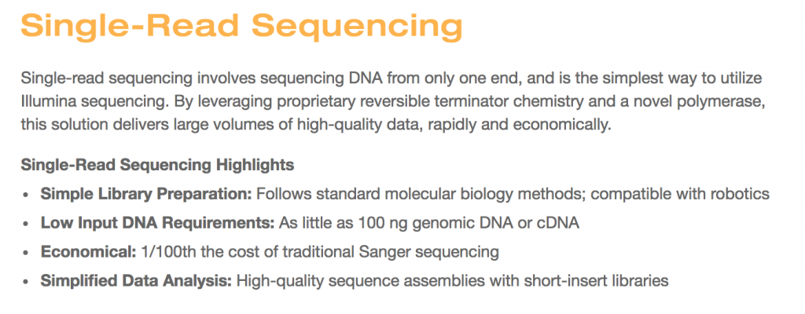
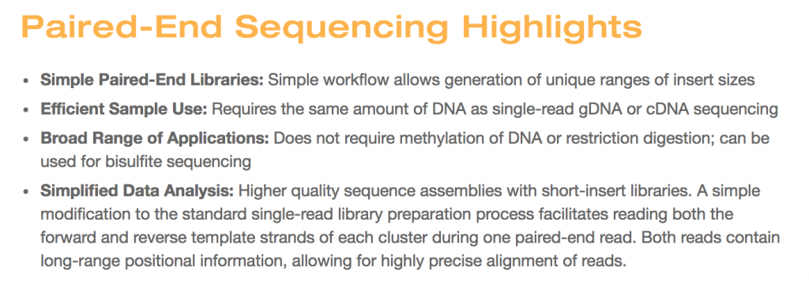
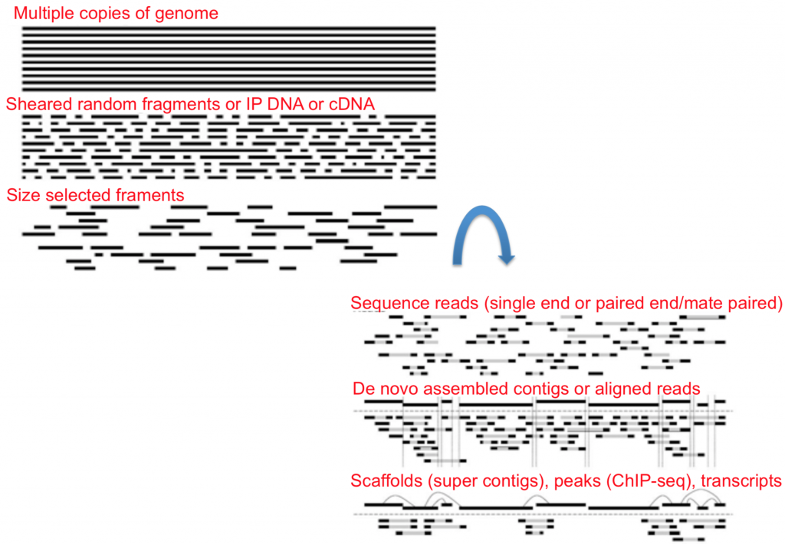
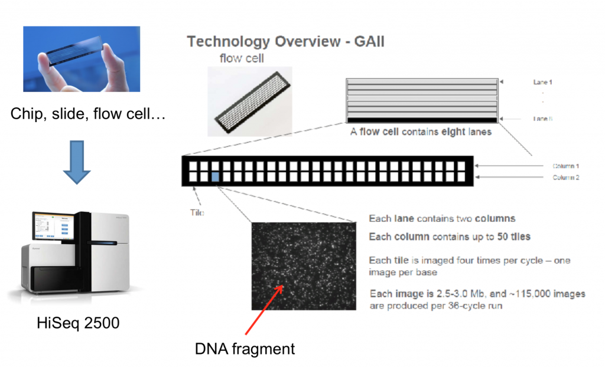

# NGS Sequencing Technology and File Formats
https://learn.gencore.bio.nyu.edu/ngs-file-formats/
$~$

### Definitions

**read**: a single sequence produced from a sequencer. Think: a sequencing machine read a molecule and this is what it thinks it is.

**library**: a collection of DNA fragments that have been prepared for sequencing. This is generally talking about individual samples.

**flowcell**: a chip on which DNA is loaded and provided to the sequencer.

**lane**: one portion of a flowcell. Usually used for technical replicates or different samples.

**run**: an entire sequencing reaction from start to finish.

---

### How Sequencing Works
There are three main steps in NGS:
1. Sample collection/preparation
2. Amplification
3. Basecalling

##### Sample Collection and Preparation

##### Single-end vs Paired-end Sequencing

##### Library Prep - Nucleic Acids Isolation and Amplification

___

### Sequencing

https://youtu.be/fCd6B5HRaZ8

---
### FastA Format
FastA contains:
- Sequence name
- Description of the sequence (metadata, sequencer info, annotations, etc.)
  - The sequence itselfit can be either nucleic acids or amino acids as long as it adheres to the format.

Each sequence consists of at least two lines
1. the sequence header/identifier, starts with a ‘>’ to the first whitespace.