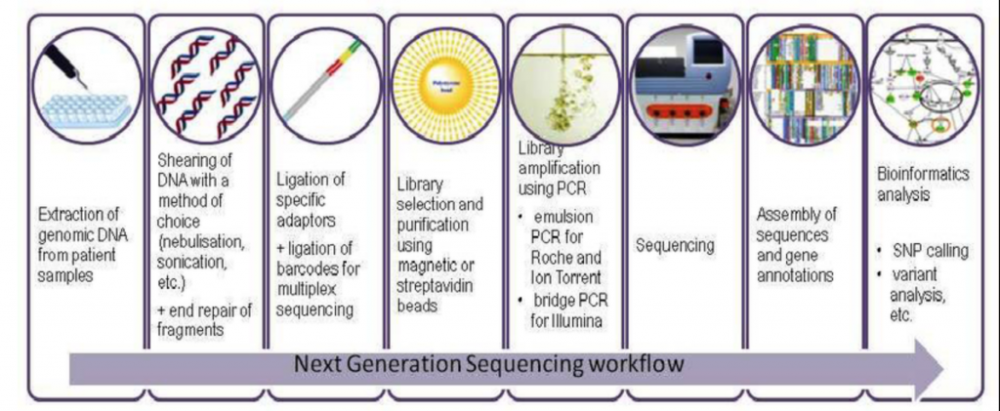
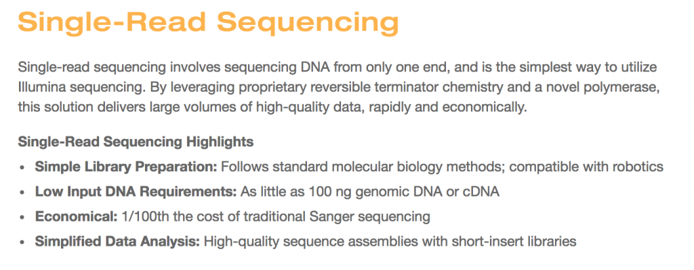
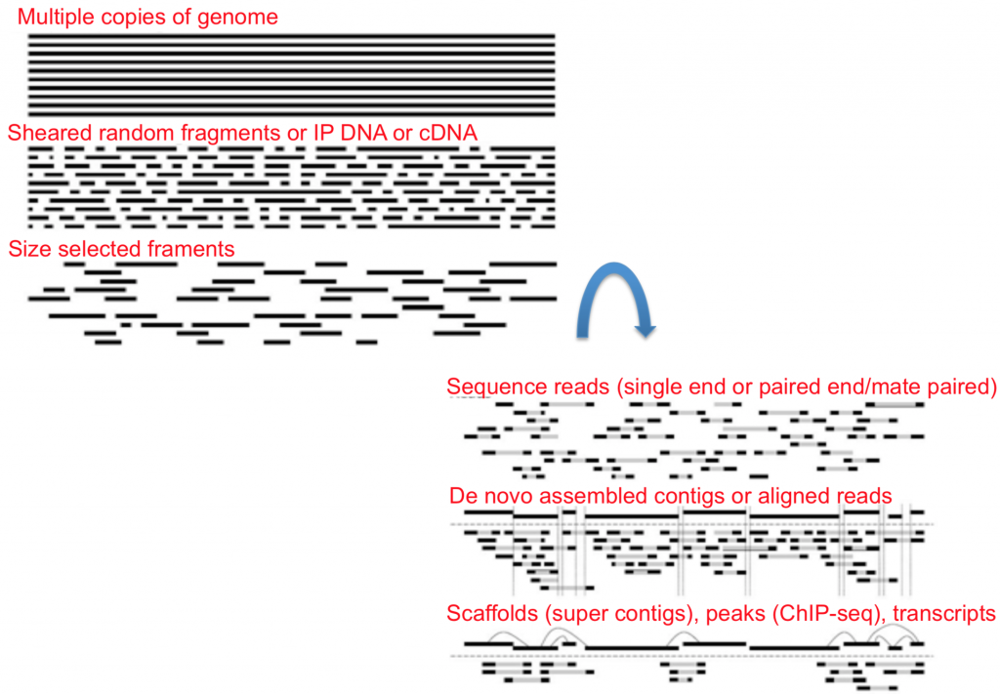
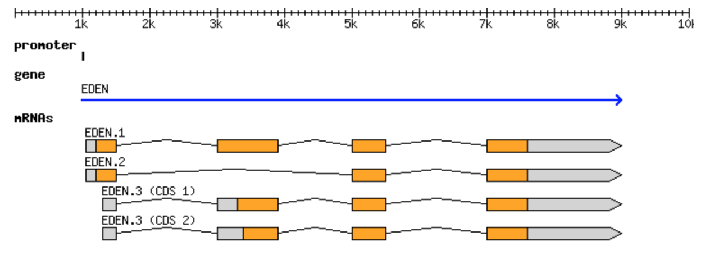

# NGS Sequencing Technology and File Formats
https://learn.gencore.bio.nyu.edu/ngs-file-formats/
$~$


### Definitions

**read**: a single sequence produced from a sequencer. Think: a sequencing machine read a molecule and this is what it thinks it is.

**library**: a collection of DNA fragments that have been prepared for sequencing. This is generally talking about individual samples.

**flowcell**: a chip on which DNA is loaded and provided to the sequencer.

**lane**: one portion of a flowcell. Usually used for technical replicates or different samples.

**run**: an entire sequencing reaction from start to finish.

---

### How Sequencing Works
There are three main steps in NGS:
1. Sample collection/preparation
2. Amplification
3. Basecalling

##### Sample Collection and Preparation


##### Single-end vs Paired-end Sequencing



##### Library Prep - Nucleic Acids Isolation and Amplification


___

### Sequencing

https://youtu.be/fCd6B5HRaZ8

---
### FastA Format
FastA contains:
- Sequence name
- Description of the sequence (metadata, sequencer info, annotations, etc.)
  - The sequence itself can be either nucleic acids or amino acids as long as it adheres to the format.

Each sequence consists of at least two lines
   - the sequence header/identifier, starts with a ‘>’ to the first whitespace.
```
>Chr1 CHROMOSOME dumped from ADB: Jun/20/09 14:53; last updated: 2009-02-02
CCCTAAACCCTAAACCCTAAACCCTAAACCTCTGAATCCTTAATCCCTAAATCCCTAAATCTTTAAATCCTACATCCAT
GAATCCCTAAATACCTAATTCCCTAAACCCGAAACCGGTTTCTCTGGTTGAAAATCATTGTGTATATAATGATAATTTT
ATCGTTTTTATGTAATTGCTTATTGTTGTGTGTAGATTTTTTAAAAATATCATTTGAGGTCAATACAAATCCTATTTCT
TGTGGTTTTCTTTCCTTCACTTAGCTATGGATGGTTTATCTTCATTTGTTATATTGGATACAAGCTTTGCTACGATCTA
CATTTGGGAATGTGAGTCTCTTATTGTAACCTTAGGGTTGGTTTATCTCAAGAATCTTATTAATTGTTTGGACTGTTTA
TGTTTGGACATTTATTGTCATTCTTACTCCTTTGTGGAAATGTTTGTTCTATCAATTTATCTTTTGTGGGAAAATTATT
TAGTTGTAGGGATGAAGTCTTTCTTCGTTGTTGTTACGCTTGTCATCTCATCTCTCAATGATATGGGATGGTCCTTTAG
CATTTATTCTGAAGTTCTTCTGCTTGATGATTTTATCCTTAGCCAAAAGGATTGGTGGTTTGAAGACACATCATATCAA
AAAAGCTATCGCCTCGACGATGCTCTATTTCTATCCTTGTAGCACACATTTTGGCACTCAAAAAAGTATTTTTAGATGT
TTGTTTTGCTTCTTTGAAGTAGTTTCTCTTTGCAAAATTCCTCTTTTTTTAGAGTGATTTGGATGATTCAAGACTTCTC
GGTACTGCAAAGTTCTTCCGCCTGATTAATTATCCATTTTACCTTTGTCGTAGATATTAGGTAATCTGTAAGTCAACTC
ATATACAACTCATAATTTAAAATAAAATTATGATCGACACACGTTTACACATAAAATCTGTAAATCAACTCATATACCC
GTTATTCCCACAATCATATGCTTTCTAAAAGCAAAAGTATATGTCAACAATTGGTTATAAATTATTAGAAGTTTTCCAC
TTATGACTTAAGAACTTGTGAAGCAGAAAGTGGCAACACCCCCCACCTCCCCCCCCCCCCCCCACCCCCCAAATTGAGA
AGTCAATTTTATATAATTTAATCAAATAAATAAGTTTATGGTTAAGAGTTTTTTACTCTCTTTATTTTTCTTTTTCTTT
```
---

### FastQ Format

The format is similar to FastA, with differences in syntax as well as integration of quality scores. Each sequence requires at least 4 lines:
$~~~$ 1. The sequence header starts with an "@"
$~~~$ 2. The second line is the sequence
$~~~$ 3. The third line starts with "+"
$~~~$ 4. The fourth line are the quality scores


##### Quality Score
- A way to assign confidence to a particular base within a read
- Represents the probability of an incorrect basecall at that position.
- Common used to filter bases or entire reads under quality threshold
  - e.g. A read's mean quality score
  ###### Phred Quality Score (Q-score)
  - Numbers (0-40) in ASCII
  - Phred-64 was only ever used by Illumina
  - industry standard of Q30 (99.9% accuracy)
  - Error Probability: $$ P=10^\frac{-Q}{10} $$

---
### SAM Format
- It is the most basic, human readable format of the three
- It consists of a header, a row for every read in dataset, and 11 tab-delimited fields describing that read
  ###### Field Descriptions - 11 mandatory fields
  e.g. 
    - Bitwise Flag - explain certain features about the particular read
    - MapQ - how well the read aligned to the reference
    - CIGAR String - explain which part of the sequence aligns, which doesn’t, and everything in between. 
---
### BAM Format
Same format of SAM, except that it encoded in binary.

### CRAM Format
Similar to BAM as it retains the same information as SAM and is compressed.

---
### BED Format
BED format defines basic sequence features to a sequence, in one line per feature. It contains 3-12 columns of data, plus optional track definition lines, generally used for user defined sequence features as well as graphical representations of features.
###### Required fields - The first three fields in each feature line
In standard chromosomal coordinates (0 for first base)
  1. Chromosome Name
  2. Chromosome Start
  3. Chromosome End

```
chr2 158365864 158367031
chr3 114514 1919810
```
###### Nine Optional fields
Note - Columns cannot be empty, lower-numbered fields must be populated if higher-numbered ones are used.
```
chr7 127471196 127472363 Pos1 0 + 127471196 127472363 255,0,0
chr7 127472363 127473530 Pos2 0 + 127472363 127473530 255,0,0
```
###### Track lines
Place at the beginning of list to affect, to further configure the display (e.g. separate features into tracks)
```
track name="ItemRGBDemo" description="Item RGB demonstration" itemRgb="On"
chr7 127471196 127472363 Pos1 0 + 127471196 127472363 255,0,0
chr7 127472363 127473530 Pos2 0 + 127472363 127473530 255,0,0
```
---
### VCF Format
Tab-delimited text used to describe single nucleotide variants (SNVs) and sequence variations with 8 required fields.

### GFF3 Format
Tab-delimited text hold any feature that can be applied to a nucleic acid or protein sequence. GFF formats varies with incompatibility.

GFF3 includes 9 required fields, though not all are utilized and in blank or a default value '.' .


The canonical gene can be represented in GFF3 format:
```
 0  ##gff-version 3.1.26
 1  ##sequence-region ctg123 1 1497228
 2  ctg123 . gene            1000  9000  .  +  .  ID=gene00001;Name=EDEN
 3  ctg123 . TF_binding_site 1000  1012  .  +  .  ID=tfbs00001;Parent=gene00001
 4  ctg123 . mRNA            1050  9000  .  +  .  ID=mRNA00001;Parent=gene00001;Name=EDEN.1
 5  ctg123 . mRNA            1050  9000  .  +  .  ID=mRNA00002;Parent=gene00001;Name=EDEN.2
 6  ctg123 . mRNA            1300  9000  .  +  .  ID=mRNA00003;Parent=gene00001;Name=EDEN.3
 7  ctg123 . exon            1300  1500  .  +  .  ID=exon00001;Parent=mRNA00003
 8  ctg123 . exon            1050  1500  .  +  .  ID=exon00002;Parent=mRNA00001,mRNA00002
 9  ctg123 . exon            3000  3902  .  +  .  ID=exon00003;Parent=mRNA00001,mRNA00003
10  ctg123 . exon            5000  5500  .  +  .  ID=exon00004;Parent=mRNA00001,mRNA00002,mRNA00003
11  ctg123 . exon            7000  9000  .  +  .  ID=exon00005;Parent=mRNA00001,mRNA00002,mRNA00003
12  ctg123 . CDS             1201  1500  .  +  0  ID=cds00001;Parent=mRNA00001;Name=edenprotein.1
13  ctg123 . CDS             3000  3902  .  +  0  ID=cds00001;Parent=mRNA00001;Name=edenprotein.1
14  ctg123 . CDS             5000  5500  .  +  0  ID=cds00001;Parent=mRNA00001;Name=edenprotein.1
15  ctg123 . CDS             7000  7600  .  +  0  ID=cds00001;Parent=mRNA00001;Name=edenprotein.1
16  ctg123 . CDS             1201  1500  .  +  0  ID=cds00002;Parent=mRNA00002;Name=edenprotein.2
17  ctg123 . CDS             5000  5500  .  +  0  ID=cds00002;Parent=mRNA00002;Name=edenprotein.2
18  ctg123 . CDS             7000  7600  .  +  0  ID=cds00002;Parent=mRNA00002;Name=edenprotein.2
19  ctg123 . CDS             3301  3902  .  +  0  ID=cds00003;Parent=mRNA00003;Name=edenprotein.3
20  ctg123 . CDS             5000  5500  .  +  1  ID=cds00003;Parent=mRNA00003;Name=edenprotein.3
21  ctg123 . CDS             7000  7600  .  +  1  ID=cds00003;Parent=mRNA00003;Name=edenprotein.3
22  ctg123 . CDS             3391  3902  .  +  0  ID=cds00004;Parent=mRNA00003;Name=edenprotein.4
23  ctg123 . CDS             5000  5500  .  +  1  ID=cds00004;Parent=mRNA00003;Name=edenprotein.4
24  ctg123 . CDS             7000  7600  .  +  1  ID=cds00004;Parent=mRNA00003;Name=edenprotein.4
```